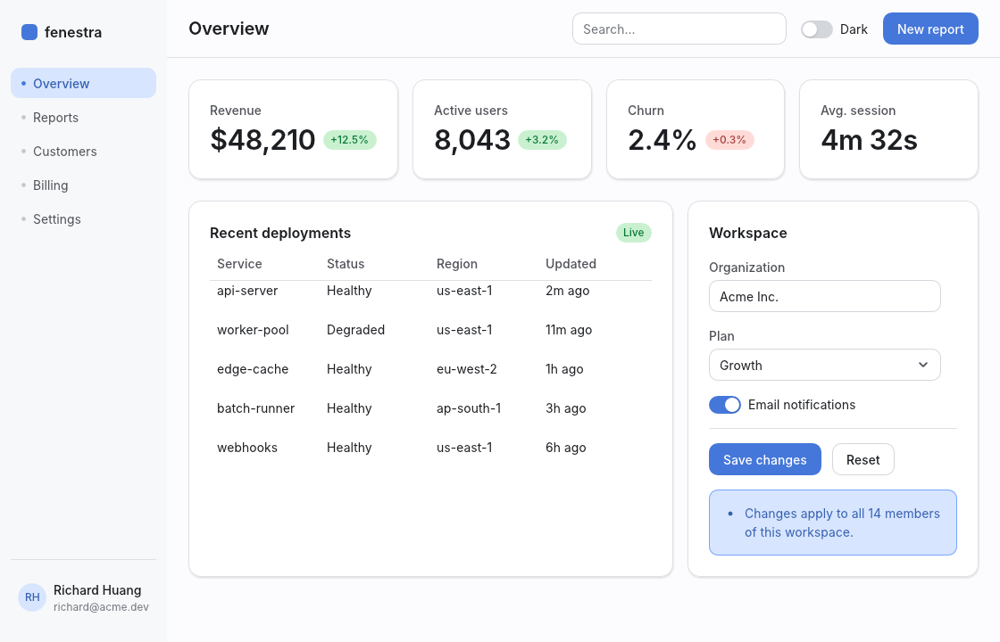
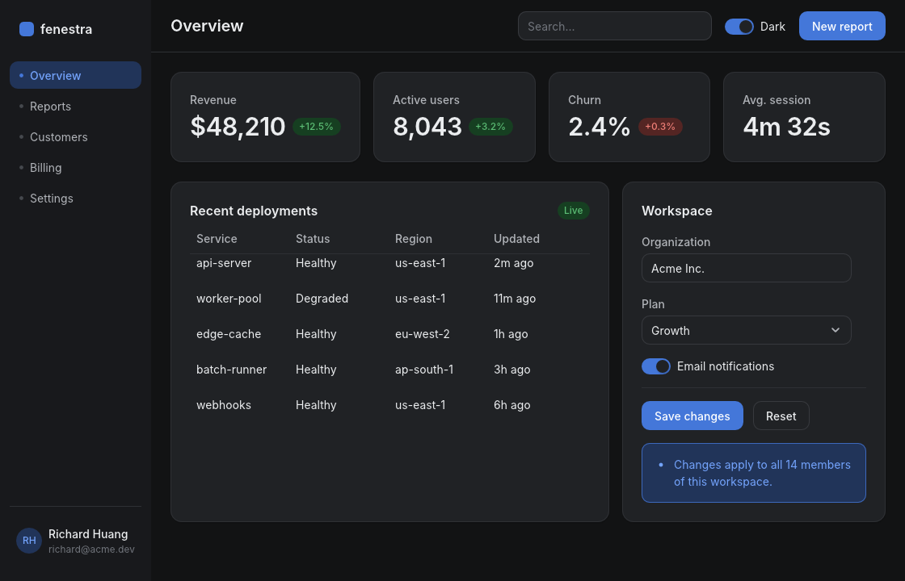
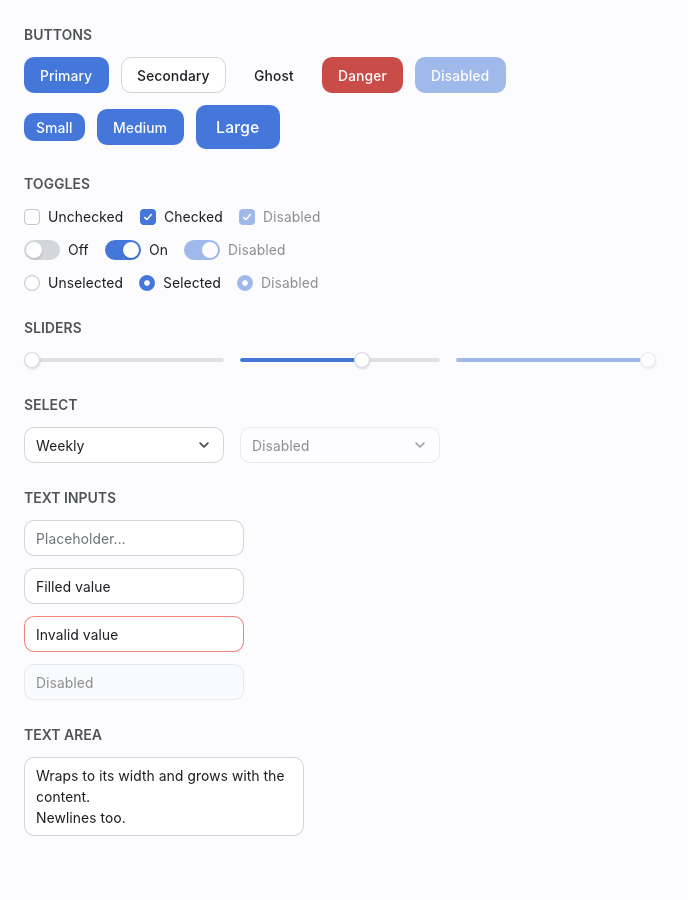
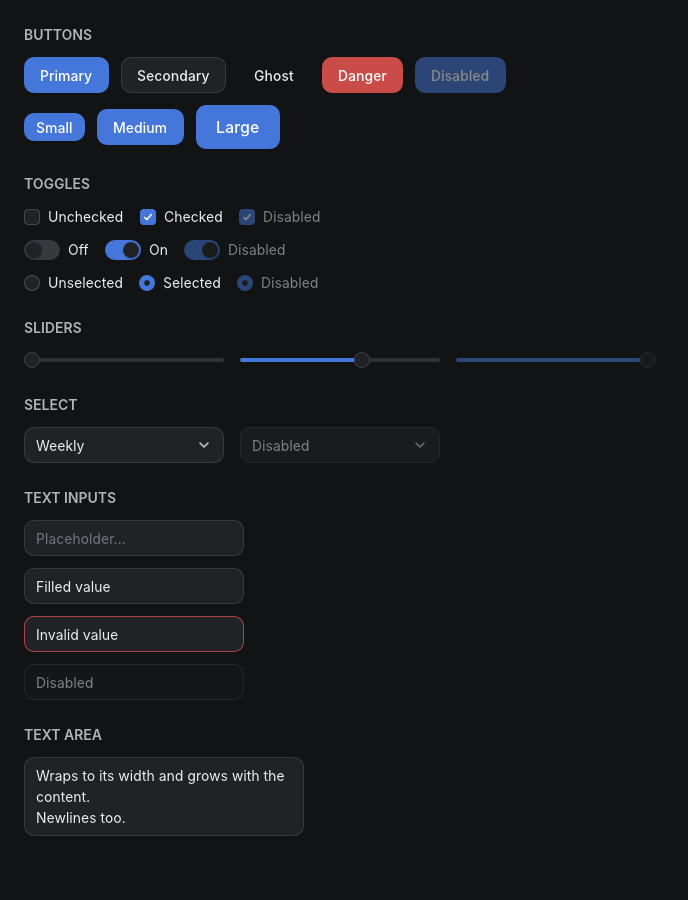
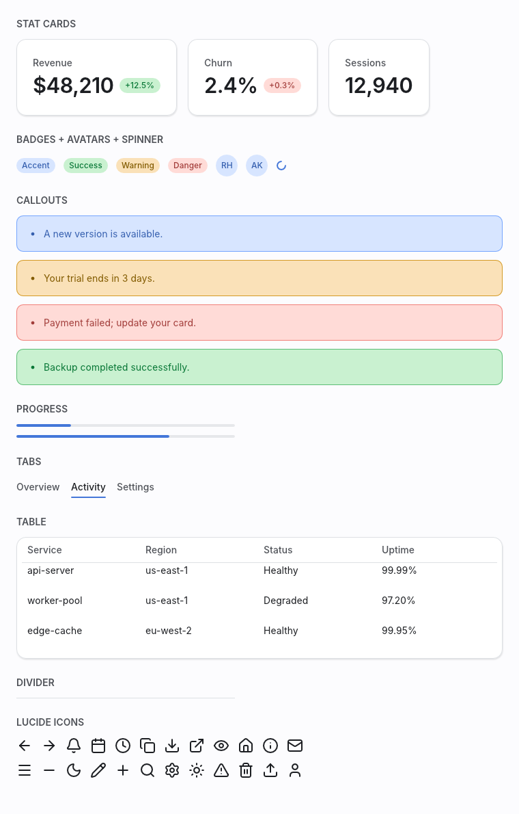
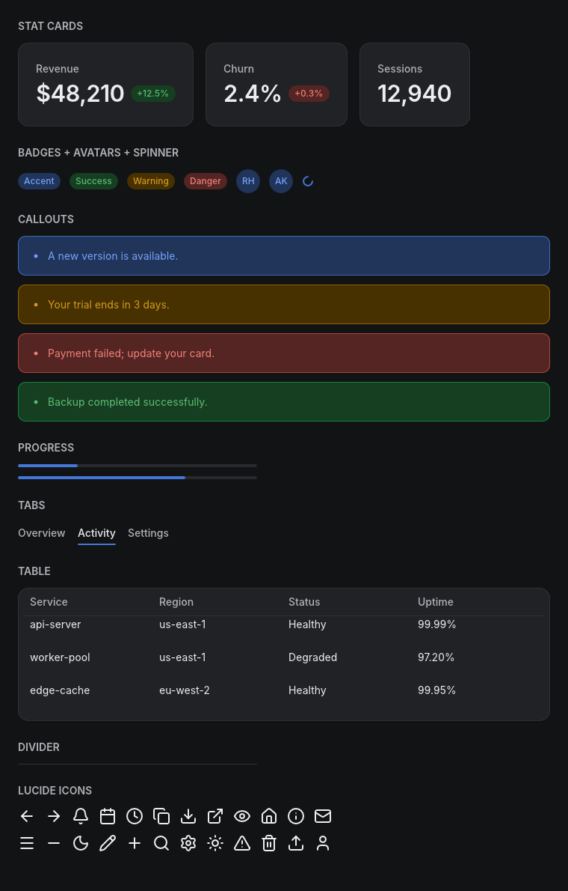

# fenestra

A pure-Rust native GUI framework with web-grade aesthetics — and first-class
headless rendering, so both humans and AI coding agents can *see* what they
build.

| Light | Dark |
| --- | --- |
|  |  |

No browser. No webview. No HTML or CSS parser. fenestra draws everything
itself with [vello] on wgpu, lays out with [taffy] (flexbox + grid), shapes
text with [parley], and ships a themed widget kit that looks like a polished
modern web app: layered soft shadows, OKLCH color ramps, real typographic
hierarchy, hover/focus transitions, and first-class light and dark themes.

[vello]: https://github.com/linebender/vello
[taffy]: https://github.com/DioxusLabs/taffy
[parley]: https://github.com/linebender/parley

## Quickstart

```rust
use fenestra::prelude::*;

struct Counter { n: i64 }

#[derive(Clone)]
enum Msg { Inc, Dec }

impl App for Counter {
    type Msg = Msg;

    fn update(&mut self, msg: Msg) {
        match msg { Msg::Inc => self.n += 1, Msg::Dec => self.n -= 1 }
    }

    fn view(&self) -> Element<Msg> {
        col().p(SP6).gap(SP4).items_center().children([
            text(self.n.to_string()).size(TextSize::Xl2).weight(Weight::Semibold),
            row().gap(SP3).children([
                button("Decrement").variant(ButtonVariant::Secondary).on_click(Msg::Dec),
                button("Increment").on_click(Msg::Inc),
            ]),
        ])
    }
}

fn main() { fenestra::run(Counter { n: 0 }, WindowOptions::titled("Counter")) }
```

`cargo add fenestra`, paste, `cargo run`. The whole view is rebuilt, laid
out, and repainted on every redraw — no diffing, no macros, everything
autocompletes.

## Agents can see what they build

Rendering `(element tree, theme, size)` to pixels is a pure function, and it
runs without a window or display server:

```rust
use fenestra::shell::{SyntheticEvent, render_app, render_element};

// A picture of any element tree:
let image = render_element(my_view(), &Theme::dark(), (800, 600));
image.save("preview.png")?;

// Or drive a full app with scripted input and look at the result:
let image = render_app(
    &mut app,
    &[
        SyntheticEvent::MouseMove { x: 50.0, y: 34.0 },
        SyntheticEvent::MouseDown,
        SyntheticEvent::MouseUp,
        SyntheticEvent::Text("hello".into()),
    ],
    (800, 600),
    &Theme::light(),
);
assert_eq!(app.value, "hello");
```

Headless rendering is deterministic (embedded fonts, fixed scale, reduced
motion), which makes pixel-exact golden tests practical — fenestra's own
widget kit is tested this way, on CI, with no GPU display attached.

## Philosophy: web aesthetics without the web platform

The web's *look* — soft elevation, tinted neutrals, OKLCH ramps, 4px-grid
spacing, focus rings, 120–300ms easing — is the best-tested visual language
in software. The web *platform* is a heavy way to get it. fenestra encodes
that language as typed Rust values: a `Theme` generated from one accent hue,
spacing/radius/shadow/motion tokens, and a builder vocabulary (`row()`,
`.p(SP4)`, `.rounded(R_MD)`, `.shadow(ShadowToken::Sm)`) small enough to
memorize and regular enough for rust-analyzer (or a language model) to
autocomplete. Every widget routes every color through the theme; flip one
`Mode` and the whole app is dark.

## The kit

Button, IconButton, Checkbox, Switch, Radio, Slider, TextInput (parley
editing, clipboard, IME), TextArea (multiline, auto-growing), Select,
Tooltip, Modal (focus trap + backdrop), Toasts, Tabs, Card, StatCard,
Badge, Avatar, Divider, Progress, Spinner, Table, Callout, and a vendored
Lucide icon subset — every state, both themes:

| | |
| --- | --- |
|  |  |
|  |  |

Regenerate this corpus any time with `cargo run --example gallery` — it
renders headlessly.

## Workspace

| Crate | Role |
| --- | --- |
| `fenestra` | Facade: prelude, `run()`, examples |
| `fenestra-core` | Element IR, theme/tokens, layout, text, paint, input, transitions |
| `fenestra-shell` | winit + wgpu window runner and the headless renderer |
| `fenestra-kit` | The themed widget kit, built only on core's public API |

See [ARCHITECTURE.md](ARCHITECTURE.md) for how the pipeline, widget
identity, transitions, and overlays work — recorded decision-by-decision as
the framework was built.

## Composition, commands, accessibility

Components written around their own message type compose with
`Element::map`. Background work flows in through `App::init`, which hands
the app a cloneable `Proxy<Msg>` — spawn a thread, send messages, the
window repaints (`examples/clock.rs`, `examples/toasts.rs`). Every widget
exposes its role, state, and name: headlessly via `Frame::access_tree()`
(assert your UI is labeled, in CI), and to real assistive technology
through AccessKit in the windowed runner. Ambient motion comes from
looping `Keyframes` timelines; images from `image_rgba8` (round avatars
via `.rounded_full()`).

## Status

0.2 covers the spec'd milestones M0–M7 — rendering, theme, text, layout
and scrolling, interactivity and transitions, text input, overlays, the
full kit, the dashboard — plus the M8 set: `Element::map`, the command
proxy, images, multiline text areas, toasts, keyframe timelines, a Lucide
icon subset, and the AccessKit tree. Out of scope so far: the
screen-reader text-editing protocol, live regions, and rich text.

## License

MIT or Apache-2.0, at your option. The embedded Inter font is licensed
under the SIL Open Font License 1.1; the vendored Lucide icon path data is
ISC (see `fenestra-kit/LICENSE-LUCIDE.txt`).
